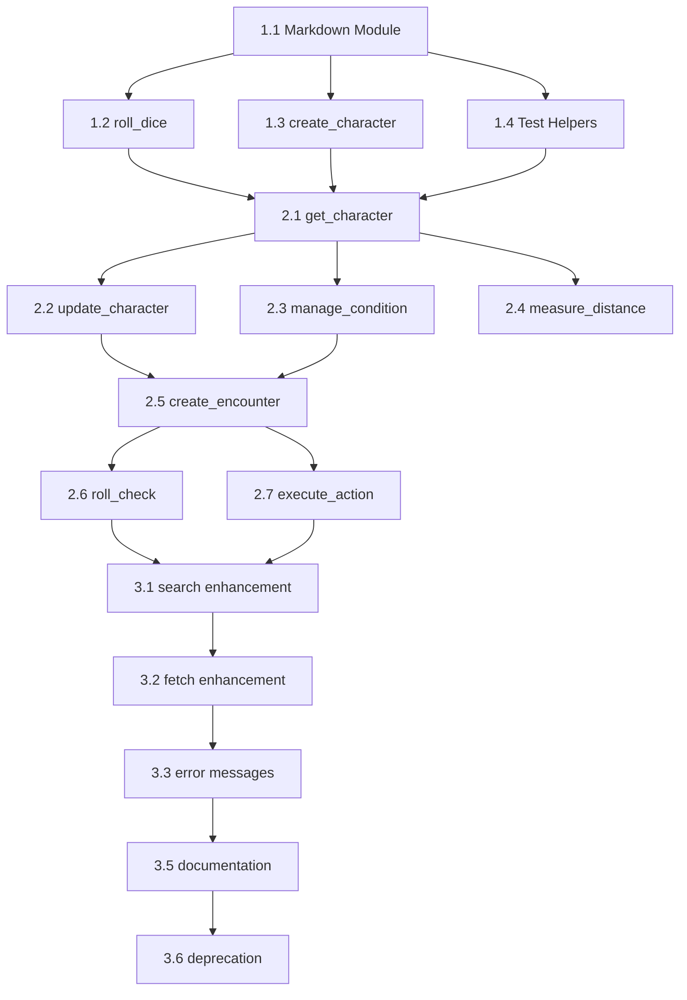

# ChatRPG Refactor Roadmap: ChatGPT Integration

## From ASCII Art to Universal Semantic Markdown

**Target:** Multi-client MCP compatibility (ChatGPT + Claude Desktop)  
**Timeline:** 3 Sprints  
**Risk Level:** Medium (Breaking changes to output format)

---

## Executive Summary

This roadmap transforms ChatRPG from a terminal-aesthetic ASCII art engine to a universal Semantic Markdown format that works seamlessly across ChatGPT and Claude Desktop.

### Key Changes
1. Replace ASCII box art with Semantic Markdown
2. Add structured `data` field to all responses
3. Standardize visual elements (HP bars, dice, conditions)
4. Improve error messages with suggestions
5. Enhance `search` and `fetch` tools for richer content

---

## Sprint 1: Foundation (Week 1)

### Goal: Create Markdown formatter module and migrate 2 pilot tools

#### Task 1.1: Create Markdown Format Module
**File:** `src/modules/markdown-format.ts`

```typescript
// New module to replace ascii-art.ts
export interface ToolResponse {
  display: string;
  data: Record<string, unknown>;
  suggestions?: string[];
}

export function toResponse(response: ToolResponse): string;
export function formatHpBar(current: number, max: number): string;
export function formatDiceResult(rolls: number[], modifier?: number): string;
export function formatAbilityTable(stats: Stats): string;
export function formatConditions(conditions: ActiveCondition[]): string;
export function formatInitiativeTable(participants: Participant[]): string;
export function formatError(title: string, message: string, suggestions?: string[]): string;
```

**Acceptance Criteria:**
- [ ] Module exports all formatting functions
- [ ] HP bars use `█░` characters with percentage
- [ ] Dice show `[n]` bracket notation
- [ ] Tables use Markdown pipe syntax
- [ ] Unit tests cover all formatters

**Estimated Effort:** 4 hours

---

#### Task 1.2: Migrate `roll_dice` Tool
**File:** `src/registry.ts` (roll_dice handler)

**Changes:**
1. Import `markdown-format.ts` instead of `ascii-art.ts`
2. Return `ToolResponse` structure with `display` + `data`
3. Update dice visualization to bracket notation
4. Add critical hit/miss visual indicators

**Before:**
```typescript
return success(formatDiceResult(result, reason)); // ASCII
```

**After:**
```typescript
return success(JSON.stringify({
  display: formatDiceRoll(result, reason),
  data: {
    success: true,
    type: 'roll',
    expression: finalExpression,
    rolls: result.rolls,
    kept: result.kept,
    total: result.total,
    critical: result.total === 20 ? 'hit' : result.total === 1 ? 'miss' : null
  },
  suggestions: reason ? undefined : ['Add a reason like "Attack roll" for clarity']
}));
```

**Acceptance Criteria:**
- [ ] Single roll output matches spec
- [ ] Batch roll output matches spec  
- [ ] Critical hit/miss indicators work
- [ ] Existing tests updated for new format
- [ ] New tests validate JSON structure

**Estimated Effort:** 3 hours

---

#### Task 1.3: Migrate `create_character` Tool
**File:** `src/modules/characters.ts`

**Changes:**
1. Replace ASCII character sheet with Markdown
2. Return structured `data` field with character object
3. Add suggestions for next steps

**Acceptance Criteria:**
- [ ] Character sheet displays in Markdown table format
- [ ] HP bar uses Unicode blocks
- [ ] Ability scores in 2-row table (score/modifier)
- [ ] `data` field contains full character object
- [ ] Tests validate new output format

**Estimated Effort:** 3 hours

---

#### Task 1.4: Update Test Infrastructure
**Files:** `tests/**/*.test.ts`

**Changes:**
1. Create test helpers for parsing `ToolResponse` JSON
2. Update assertions to check `display` contains expected text
3. Add assertions for `data` structure validation

```typescript
// tests/helpers.ts additions
export function parseToolResponse(result: CallToolResult): ToolResponse {
  const text = result.content[0]?.text;
  return JSON.parse(text);
}

export function expectDisplayContains(result: CallToolResult, text: string) {
  const response = parseToolResponse(result);
  expect(response.display).toContain(text);
}

export function expectDataField(result: CallToolResult, path: string, value: unknown) {
  const response = parseToolResponse(result);
  const actual = get(response.data, path);
  expect(actual).toEqual(value);
}
```

**Acceptance Criteria:**
- [ ] Helper functions work for all response types
- [ ] Existing tests refactored to use helpers
- [ ] All 213 tests still pass

**Estimated Effort:** 2 hours

---

### Sprint 1 Deliverables
- [ ] `markdown-format.ts` module complete
- [ ] `roll_dice` migrated with tests
- [ ] `create_character` migrated with tests
- [ ] Test helpers established
- [ ] Documentation updated

**Total Sprint 1 Effort:** ~12 hours

---

## Sprint 2: Core Tools Migration (Week 2)

### Goal: Migrate remaining 6 implemented tools

#### Task 2.1: Migrate `get_character`
**Effort:** 2 hours

**Special Considerations:**
- Must show effective stats with condition modifiers
- Condition icons from spec
- Equipment section (placeholder if not set)

---

#### Task 2.2: Migrate `update_character`
**Effort:** 2 hours

**Special Considerations:**
- Before/after comparison in display
- Batch updates show summary table
- HP delta shows visual change

---

#### Task 2.3: Migrate `manage_condition`
**Effort:** 3 hours

**Special Considerations:**
- Add/Remove/Query all have distinct formats
- Condition icons must match spec
- Mechanical effects displayed
- Batch operations show success/failure summary

---

#### Task 2.4: Migrate `measure_distance`
**Effort:** 1 hour

**Special Considerations:**
- Clean table for distance results
- Movement cost breakdown
- No arrow path rendering (not needed)

---

#### Task 2.5: Migrate `create_encounter`
**Effort:** 3 hours

**Special Considerations:**
- Initiative table with status icons
- Environment info block
- Current turn indicator
- Participant list with HP/AC

---

#### Task 2.6: Migrate `roll_check`
**Effort:** 2 hours

**Special Considerations:**
- DC comparison with pass/fail indicator
- Advantage/disadvantage display
- Critical success/fail styling
- Skill/ability/save type labeling

---

#### Task 2.7: Migrate `execute_action`
**Effort:** 3 hours

**Special Considerations:**
- Attack results with hit/miss
- Damage application with HP change
- State changes (conditions added/removed)
- Turn/round context

---

### Sprint 2 Deliverables
- [ ] All 8 implemented tools use Markdown format
- [ ] ASCII art module marked deprecated
- [ ] All tests pass with new format
- [ ] Output Format Spec validated against implementations

**Total Sprint 2 Effort:** ~16 hours

---

## Sprint 3: Enhancement & Polish (Week 3)

### Goal: Enhance ChatGPT-specific features and documentation

#### Task 3.1: Enhance `search` Tool
**File:** `src/registry.ts`

**Changes:**
1. Expand content database (more spells, monsters, rules)
2. Add fuzzy matching for typos
3. Return structured results with preview text

```typescript
// Enhanced search result
{
  results: [
    {
      id: 'spell-fireball',
      title: 'Fireball',
      type: 'spell',
      preview: '3rd-level evocation, 8d6 fire damage in 20ft radius',
      url: 'https://5e.d20srd.org/srd/spells/fireball.htm'
    }
  ],
  total: 15,
  query: 'fire spell'
}
```

**Effort:** 3 hours

---

#### Task 3.2: Enhance `fetch` Tool
**File:** `src/registry.ts`

**Changes:**
1. Return content in Markdown format (not raw text)
2. Add related content suggestions
3. Include mechanical details in structured data

```typescript
{
  display: "## Fireball\n3rd-level evocation...",
  data: {
    id: 'spell-fireball',
    type: 'spell',
    level: 3,
    school: 'evocation',
    damage: '8d6',
    damageType: 'fire',
    range: '150 feet',
    aoe: { shape: 'sphere', radius: 20 }
  },
  related: ['spell-fire-bolt', 'spell-burning-hands', 'spell-flame-strike']
}
```

**Effort:** 3 hours

---

#### Task 3.3: Error Message Enhancement
**All tool files**

**Changes:**
1. Replace terse errors with helpful suggestions
2. Add "did you mean?" for typos
3. Include example commands

**Effort:** 2 hours

---

#### Task 3.4: Client Detection (Optional)
**File:** `src/registry.ts`

**Research Task:** Investigate if MCP provides client identification

If available:
- Add `OUTPUT_MODE` environment variable
- Support `markdown` (default) and `json-only` modes
- Allow ASCII fallback for terminal clients

**Effort:** 2 hours (research) + 4 hours (if implementing)

---

#### Task 3.5: Documentation Update
**Files:** `README.md`, `DESIGN.md`, `TOOLS_CHECKLIST.md`

**Changes:**
1. Update output examples to Markdown format
2. Document `ToolResponse` structure
3. Add ChatGPT integration section to README
4. Update TOOLS_CHECKLIST with format migration status

**Effort:** 2 hours

---

#### Task 3.6: Deprecation & Cleanup
**File:** `src/modules/ascii-art.ts`

**Changes:**
1. Add deprecation notice to file header
2. Keep for reference (don't delete yet)
3. Remove imports from active tool files

**Effort:** 1 hour

---

### Sprint 3 Deliverables
- [ ] Enhanced `search` with fuzzy matching
- [ ] Enhanced `fetch` with rich content
- [ ] All errors have suggestions
- [ ] Documentation fully updated
- [ ] ASCII art module deprecated

**Total Sprint 3 Effort:** ~15 hours

---

## Post-Refactor Validation

### Testing Checklist

| Test | Client | Status |
|------|--------|--------|
| Character creation | ChatGPT | [ ] |
| Character creation | Claude Desktop | [ ] |
| Dice rolling (single) | ChatGPT | [ ] |
| Dice rolling (batch) | ChatGPT | [ ] |
| Encounter creation | ChatGPT | [ ] |
| Skill checks | ChatGPT | [ ] |
| Condition management | ChatGPT | [ ] |
| Search tool | ChatGPT | [ ] |
| Fetch tool | ChatGPT | [ ] |
| Error handling | ChatGPT | [ ] |

### Performance Validation

- [ ] Response size (tokens) within acceptable range
- [ ] No rendering issues in ChatGPT
- [ ] Tables display correctly
- [ ] Emoji render properly
- [ ] HP bars align correctly

---

## Risk Mitigation

### Breaking Change Communication

**Version Bump:** 0.1.0 → 0.2.0

**Changelog Entry:**
```markdown
## v0.2.0 - ChatGPT Integration

### Breaking Changes
- Tool output format changed from ASCII art to Semantic Markdown
- All tools now return JSON with `display` and `data` fields
- Clients parsing raw output must update to parse JSON

### New Features
- Universal client support (ChatGPT, Claude Desktop, Claude.ai)
- Structured data in responses for programmatic access
- Enhanced error messages with suggestions
- Improved search and fetch tools
```

### Rollback Plan

If critical issues discovered:
1. Revert to v0.1.x branch
2. ASCII art module still available
3. Feature flag `OUTPUT_MODE=ascii` as emergency fallback

---

## Task Dependencies



---

## Success Criteria

### Functional
- [ ] All 8 tools output valid Semantic Markdown
- [ ] ChatGPT renders output correctly
- [ ] Claude Desktop renders output 213+ tests pass
- [ ] No regression in game functionality

### Performance
- [ ] Response size ≤ 150% of current (token budget)
- [ ] No additional latency introduced

### Quality
- [ ] Output Format Spec compliance verified
- [ ] Documentation complete and accurate
- [ ] Deprecation warnings in place

---

## Orchestrator Notes

### Parallelization Opportunities
- Tasks 2.1-2.4 can run in parallel after Sprint 1
- Tasks 3.1-3.2 can run in parallel
- Documentation can be updated incrementally

### Worker Assignment Recommendations
- Sprint 1: Single worker (establishes patterns)
- Sprint 2: 2 workers possible (split by tool complexity)
- Sprint 3: 2 workers (enhancements vs documentation)

### Review Gates
1. After Task 1.1: Review Markdown module design
2. After Sprint 1: Validate pilot tool format
3. After Sprint 2: Full format compliance check
4. After Sprint 3: Final QA on both clients

---

_Refactor Roadmap v1.0 • ChatRPG ChatGPT Integration • 2025-12-19_
